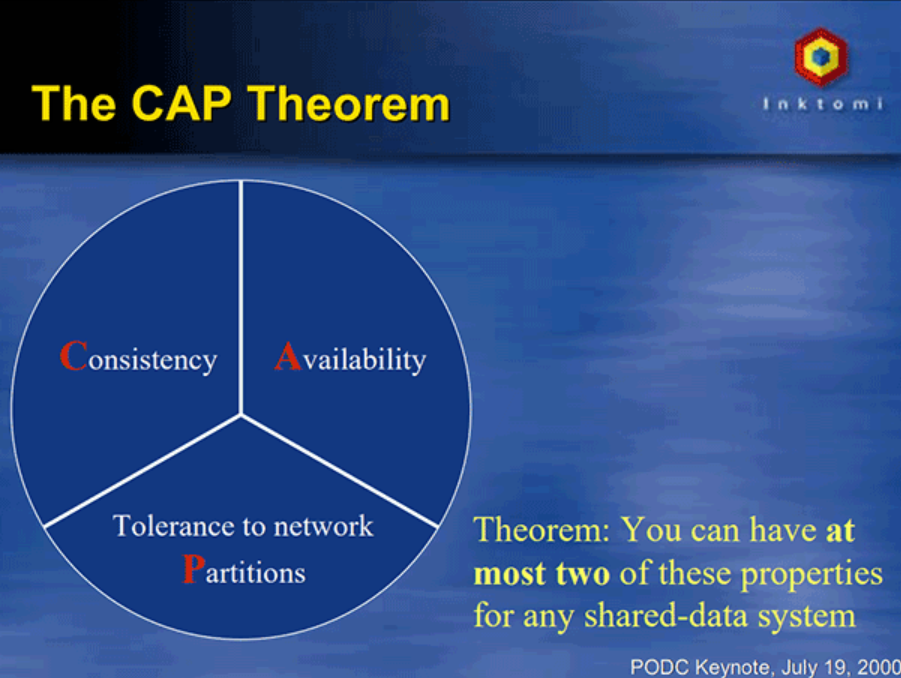

# 事务处理
事务处理几乎在每一个信息系统中都会涉及，它存在的意义是为了保证系统中所有的数据都是符合期望的，且相互关联的数据之间不会产生矛盾，即数据状态的一致性（Consistency）。

按照数据库的经典理论，要达成这个目标，需要三方面共同努力来保障。

- 原子性（Atomic）：在同一项业务处理过程中，事务保证了对多个数据的修改，要么同时成功，要么同时被撤销。
- 隔离性（Isolation）：在不同的业务处理过程中，事务保证了各自业务正在读、写的数据互相独立，不会彼此影响。
- 持久性（Durability）：事务应当保证所有成功被提交的数据修改都能够正确地被持久化，不丢失数据。 
  
以上四种属性即事务的“ACID”特性，但笔者对这种说法其实不是太认同，因为这四种特性并不正交，A、I、D 是手段，C 是目的，前者是因，后者是果，弄到一块去完全是为了拼凑个单词缩写。

内部一致性：当一个服务只使用一个数据源时，通过 A、I、D 来获得一致性是最经典的做法，也是相对容易的。此时，多个并发事务所读写的数据能够被数据源感知是否存在冲突，并发事务的读写在时间线上的最终顺序是由数据源来确定的，这种事务间一致性被称为“内部一致性”。

外部一致性：当一个服务使用到多个不同的数据源，甚至多个不同服务同时涉及多个不同的数据源时，问题就变得相对困难了许多。此时，并发执行甚至是先后执行的多个事务，在时间线上的顺序并不由任何一个数据源来决定，这种涉及多个数据源的事务间一致性被称为“外部一致性”。
外部一致性问题通常很难再使用 A、I、D 来解决，因为这样需要付出很大乃至不切实际的代价；但是外部一致性又是分布式系统中必然会遇到且必须要解决的问题，为此我们要转变观念，将一致性从“是或否”的二元属性转变为可以按不同强度分开讨论的多元属性，在确保代价可承受的前提下获得强度尽可能高的一致性保障，也正因如此，事务处理才从一个具体操作上的“编程问题”上升成一个需要全局权衡的“架构问题”。

## 本地事务
本地事务是最基础的一种事务解决方案，只适用于单个服务使用单个数据源的场景。 
从应用角度看，它是直接依赖于数据源本身提供的事务能力来工作的，在程序代码层面，最多只能对事务接口做一层标准化的包装（如 JDBC 接口），并不能深入参与到事务的运作过程当中，事务的开启、终止、提交、回滚、嵌套、设置隔离级别，乃至与应用代码贴近的事务传播方式，全部都要依赖底层数据源的支持才能工作。

举个例子，假设你的代码调用了 JDBC 中的Transaction::rollback()方法，方法的成功执行也并不一定代表事务就已经被成功回滚，如果数据表采用的引擎是MyISAM，那rollback()方法便是一项没有意义的空操作。因此，我们要想深入地讨论本地事务，便不得不越过应用代码的层次，去了解一些数据库本身的事务实现原理，弄明白传统数据库管理系统是如何通过 ACID 来实现事务的。

### 实现原子性和持久性
原子性和持久性在事务里是密切相关的两个属性，原子性保证了事务的多个操作要么都生效要么都不生效，不会存在中间状态；持久性保证了一旦事务生效，就不会再因为任何原因而导致其修改的内容被撤销或丢失。

众所周知，数据必须要成功写入磁盘、磁带等持久化存储器后才能拥有持久性，只存储在内存中的数据，一旦遇到应用程序忽然崩溃，或者数据库、操作系统一侧的崩溃，甚至是机器突然断电宕机等情况就会丢失，后文我们将这些意外情况都统称为“崩溃”（Crash）。实现原子性和持久性的最大困难是“写入磁盘”这个操作并不是原子的，不仅有“写入”与“未写入”状态，还客观地存在着“正在写”的中间状态。正因为写入中间状态与崩溃都不可能消除，所以如果不做额外保障措施的话，将内存中的数据写入磁盘，并不能保证原子性与持久性。

由于写入中间状态与崩溃都是无法避免的，为了保证原子性和持久性，就只能在崩溃后采取恢复的补救措施，这种数据恢复操作被称为“崩溃恢复”（Crash Recovery，也有资料称作 Failure Recovery 或 Transaction Recovery）。

为了能够顺利地完成崩溃恢复，在磁盘中写入数据就不能像程序修改内存中变量值那样，直接改变某表某行某列的某个值，而是必须将修改数据这个操作所需的全部信息，包括修改什么数据、数据物理上位于哪个内存页和磁盘块中、从什么值改成什么值，等等，以日志的形式——即仅进行顺序追加的文件写入的形式（这是最高效的写入方式）先记录到磁盘中。只有在日志记录全部都安全落盘，数据库在日志中看到代表事务成功提交的“提交记录”（Commit Record）后，才会根据日志上的信息对真正的数据进行修改，修改完成后，再在日志中加入一条“结束记录”（End Record）表示事务已完成持久化，这种事务实现方法被称为 **“Commit Logging”（提交日志）**。

Commit Logging 保障数据持久性、原子性的原理并不难理解：首先，日志一旦成功写入 Commit Record，那整个事务就是成功的，即使真正修改数据时崩溃了，重启后根据已经写入磁盘的日志信息恢复现场、继续修改数据即可，这保证了持久性；其次，如果日志没有成功写入 Commit Record 就发生崩溃，那整个事务就是失败的，系统重启后会看到一部分没有 Commit Record 的日志，那将这部分日志标记为回滚状态即可，整个事务就像完全没好有发生过一样，这保证了原子性。

### 实现隔离性

隔离性保证了每个事务各自读、写的数据互相独立，不会彼此影响。只从定义上就能嗅出隔离性肯定与并发密切相关，因为如果没有并发，所有事务全都是串行的，那就不需要任何隔离，或者说这样的访问具备了天然的隔离性。但现实情况不可能没有并发，要在并发下实现串行的数据访问该怎样做？几乎所有程序员都会回答：加锁同步呀！正确，现代数据库均提供了以下三种锁。

- 写锁（Write Lock，也叫作排他锁，eXclusive Lock，简写为 X-Lock）：如果数据有加写锁，就只有持有写锁的事务才能对数据进行写入操作，数据加持着写锁时，其他事务不能写入数据，也不能施加读锁。
- 读锁（Read Lock，也叫作共享锁，Shared Lock，简写为 S-Lock）：多个事务可以对同一个数据添加多个读锁，数据被加上读锁后就不能再被加上写锁，所以其他事务不能对该数据进行写入，但仍然可以读取。对于持有读锁的事务，如果该数据只有它自己一个事务加了读锁，允许直接将其升级为写锁，然后写入数据。
- 范围锁（Range Lock）：对于某个范围直接加排他锁，在这个范围内的数据不能被写入。

串行化访问提供了强度最高的隔离性，ANSI/ISO SQL-92中定义的最高等级的隔离级别便是可串行化（Serializable）。可串行化完全符合普通程序员对数据竞争加锁的理解，如果不考虑性能优化的话，对事务所有读、写的数据全都加上读锁、写锁和范围锁即可做到可串行化（“即可”是简化理解，实际还是很复杂的，要分成 Expanding 和 Shrinking 两阶段去处理读锁、写锁与数据间的关系，称为Two-Phase Lock，2PL）。但数据库不考虑性能肯定是不行的，并发控制理论（Concurrency Control）决定了隔离程度与并发能力是相互抵触的，隔离程度越高，并发访问时的吞吐量就越低。现代数据库一定会提供除可串行化以外的其他隔离级别供用户使用，让用户调节隔离级别的选项，根本目的是让用户可以调节数据库的加锁方式，取得隔离性与吞吐量之间的平衡。

#### MVCC

近年来有一种名为“多版本并发控制”（Multi-Version Concurrency Control，MVCC）的无锁优化方案被主流的商业数据库广泛采用。MVCC 是一种读取优化策略，它的“无锁”是特指读取时不需要加锁。MVCC 的基本思路是对数据库的任何修改都不会直接覆盖之前的数据，而是产生一个新版副本与老版本共存，以此达到读取时可以完全不加锁的目的。在这句话中，“版本”是个关键词，你不妨将版本理解为数据库中每一行记录都存在两个看不见的字段：CREATE_VERSION 和 DELETE_
VERSION，这两个字段记录的值都是事务 ID，事务 ID 是一个全局严格递增的数值.

MVCC 是只针对“读+写”场景的优化，如果是两个事务同时修改数据，即“写+写”的情况，那就没有多少优化的空间了，此时加锁几乎是唯一可行的解决方案，稍微有点讨论余地的是加锁的策略是“乐观加锁”（Optimistic Locking）还是“悲观加锁”（Pessimistic Locking）。

## 全局事务
在本节里，全局事务被限定为一种适用于单个服务使用多个数据源场景的事务解决方案。

1991 年，为了解决分布式事务的一致性问题，X/Open组织（后来并入了The Open Group）提出了一套名为X/Open XA（XA 是 eXtended Architecture 的缩写）的处理事务架构，其核心内容是定义了全局的事务管理器（Transaction Manager，用于协调全局事务）和局部的资源管理器（Resource Manager，用于驱动本地事务）之间的通信接口。XA 接口是双向的，能在一个事务管理器和多个资源管理器（Resource Manager）之间形成通信桥梁，通过协调多个数据源的一致动作，实现全局事务的统一提交或者统一回滚，现在我们在 Java 代码中还偶尔能看见的 XADataSource、XAResource 这些名字都源于此。

不过，XA 并不是 Java 的技术规范（XA 提出那时还没有 Java），而是一套语言无关的通用规范，所以 Java 中专门定义了JSR 907 Java Transaction API，基于 XA 模式在 Java 语言中的实现了全局事务处理的标准，这也就是我们现在所熟知的 JTA。JTA 最主要的两个接口是：

- 事务管理器的接口：javax.transaction.TransactionManager。这套接口是给 Java EE 服务器提供容器事务（由容器自动负责事务管理）使用的，还提供了另外一套javax.transaction.UserTransaction接口，用于通过程序代码手动开启、提交和回滚事务。
- 满足 XA 规范的资源定义接口：javax.transaction.xa.XAResource，任何资源（JDBC、JMS 等等）如果想要支持 JTA，只要实现 XAResource 接口中的方法即可。

XA 将事务提交拆分成为两阶段过程：

- 准备阶段：又叫作投票阶段，在这一阶段，协调者询问事务的所有参与者是否准备好提交，参与者如果已经准备好提交则回复 Prepared，否则回复 Non-Prepared。
- 提交阶段：又叫作执行阶段，协调者如果在上一阶段收到所有事务参与者回复的 Prepared 消息，则先自己在本地持久化事务状态为 Commit，在此操作完成后向所有参与者发送 Commit 指令，所有参与者立即执行提交操作；否则，任意一个参与者回复了 Non-Prepared 消息，或任意一个参与者超时未回复，协调者将自己的事务状态持久化为 Abort 之后，向所有参与者发送 Abort 指令，参与者立即执行回滚操作。

两段式提交原理简单，并不难实现，但有几个非常显著的缺点：

- 单点问题
- 性能问题
- 一致性风险

为了缓解两段式提交协议的一部分缺陷，具体地说是协调者的单点问题和准备阶段的性能问题，后续又发展出了“三段式提交”（3 Phase Commit，3PC）协议。三段式提交把原本的两段式提交的准备阶段再细分为两个阶段，分别称为 CanCommit、PreCommit，把提交阶段改称为 DoCommit 阶段

## 共享事务
与全局事务里讨论的单个服务使用多个数据源正好相反，共享事务（Share Transaction）是指多个服务共用同一个数据源。这里有必要再强调一次“数据源”与“数据库”的区别：数据源是指提供数据的逻辑设备，不必与物理设备一一对应。在部署应用集群时最常采用的模式是将同一套程序部署到多个中间件服务器上，构成多个副本实例来分担流量压力。它们虽然连接了同一个数据库，但每个节点配有自己的专属的数据源，通常是中间件以 JNDI 的形式开放给程序代码使用。这种情况下，所有副本实例的数据访问都是完全独立的，并没有任何交集，每个节点使用的仍是最简单的本地事务

而本节讨论的是多个服务之间会产生业务交集的场景，举个具体例子，在 Fenix's Bookstore 的场景事例中，假设用户账户、商家账户和商品仓库都存储于同一个数据库之中，但用户、商户和仓库每个领域都部署了独立的微服务，此时一次购书的业务操作将贯穿三个微服务，它们都要在数据库中修改数据。如果我们直接将不同数据源就视为是不同数据库，那上一节所讲的全局事务和下一节要讲的分布式事务都是可行的，不过，针对这种每个数据源连接的都是同一个物理数据库的特例，共享事务则有机会成为另一条可能提高性能、降低复杂度的途径，当然，也很有可能是一个伪需求。

一种理论可行的方案是直接让各个服务共享数据库连接。

笔者把共享事务列为本章四种事务类型之一只是为了叙述逻辑的完备，尽管拆分微服务后仍然共享数据库的情况在现实中并不少见，但笔者个人不赞同将共享事务作为一种常规的解决方案来考量。

## 分布式事务

本章中所说的分布式事务（Distributed Transaction）特指多个服务同时访问多个数据源的事务处理机制。本节所指的“分布式”是相对于服务而言的，如果严谨地说，它更应该被称为“在分布式服务环境下的事务处理机制”。

在 2000 年以前，人们曾经寄希望于 XA 的事务机制可以在本节所说的分布式环境中也能良好地应用，但这个美好的愿望今天已经被 CAP 理论彻底地击碎了，接下来就先从 CAP 与 ACID 的矛盾说起。

### CAP 与 ACID

CAP 定理（Consistency、Availability、Partition Tolerance Theorem），也称为 Brewer 定理，起源于在 2000 年 7 月，是加州大学伯克利分校的 Eric Brewer 教授于“ACM 分布式计算原理研讨会（PODC）”上提出的一个猜想。

两年之后，麻省理工学院的 Seth Gilbert 和 Nancy Lynch 以严谨的数学推理证明了 CAP 猜想。自此，CAP 正式从猜想变为分布式计算领域所公认的著名定理。这个定理里描述了一个分布式的系统中，涉及共享数据问题时，以下三个特性最多只能同时满足其中两个：

- 一致性（Consistency）：代表数据在任何时刻、任何分布式节点中所看到的都是符合预期的。一致性在分布式研究中是有严肃定义、有多种细分类型的概念，以后讨论分布式共识算法时，我们还会再提到一致性，那种面向副本复制的一致性与这里面向数据库状态的一致性严格来说并不完全等同，具体差别我们将在后续分布式共识算法中再作探讨。
- 可用性（Availability）：代表系统不间断地提供服务的能力，理解可用性要先理解与其密切相关两个指标：可靠性（Reliability）和可维护性（Serviceability）。可靠性使用平均无故障时间（Mean Time Between Failure，MTBF）来度量；可维护性使用平均可修复时间（Mean Time To Repair，MTTR）来度量。可用性衡量系统可以正常使用的时间与总时间之比，其表征为：A=MTBF/（MTBF+MTTR），即可用性是由可靠性和可维护性计算得出的比例值，譬如 99.9999%可用，即代表平均年故障修复时间为 32 秒。
- 分区容忍性（Partition Tolerance）：代表分布式环境中部分节点因网络原因而彼此失联后，即与其他节点形成“网络分区”时，系统仍能正确地提供服务的能力。

