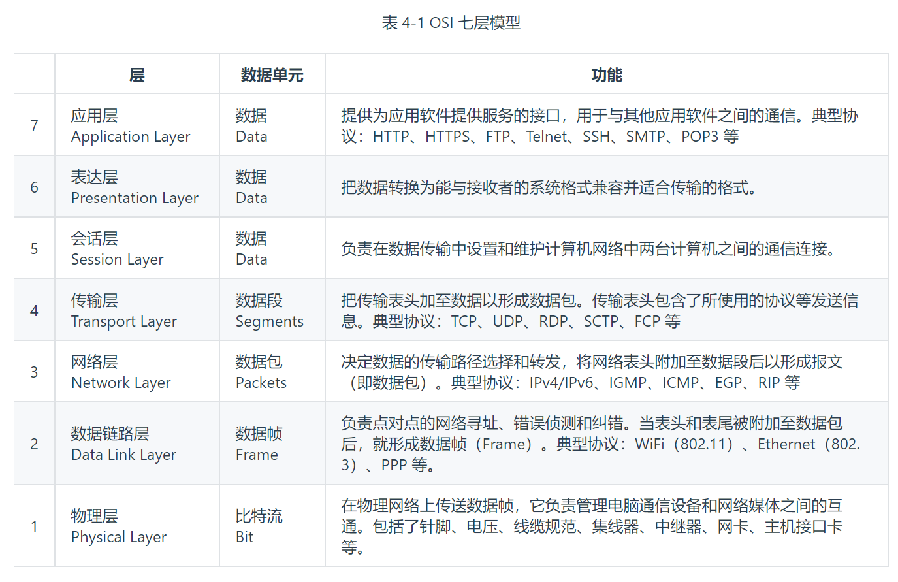
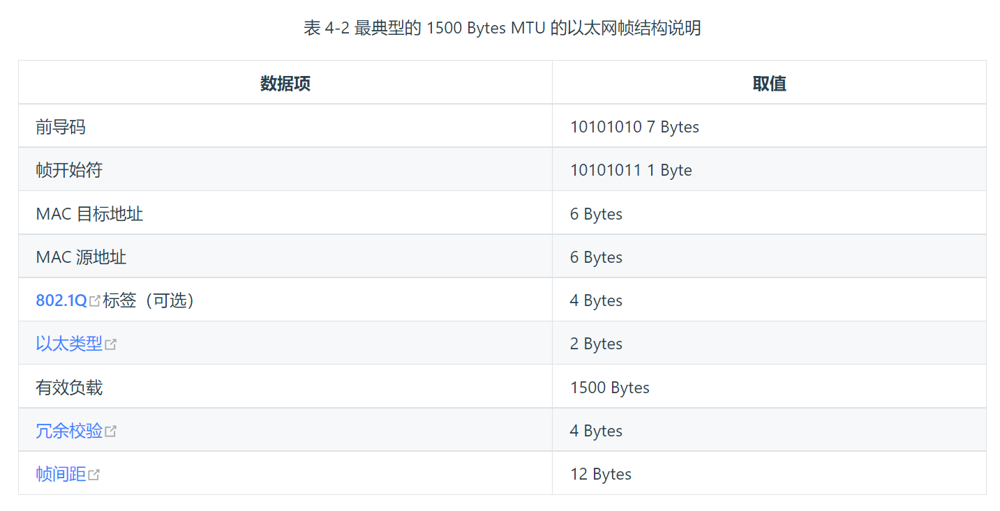

# 透明多级分流系统
现代的企业级或互联网系统，“分流”是必须要考虑的设计，分流所使用手段数量之多、涉及场景之广，可能连它的开发者本身都未必能全部意识到。这听起来似乎并不合理，但笔者认为这恰好是优秀架构设计的一种体现，“分布广阔”源于“多级”，“意识不到”谓之“透明”，也即本章我们要讨论的主题“透明多级分流系统”（Transparent Multilevel Diversion System， “透明多级分流系统”这个词是笔者自己创造的，业内通常只提“Transparent Multilevel Cache”，但我们这里谈的并不仅仅涉及到缓存）的来由。

在用户使用信息系统的过程中，请求从浏览器出发，在域名服务器的指引下找到系统的入口，经过网关、负载均衡器、缓存、服务集群等一系列设施，最后触及到末端存储于数据库服务器中的信息，然后逐级返回到用户的浏览器之中。这其中要经过很多技术部件。作为系统的设计者，我们应该意识到不同的设施、部件在系统中有各自不同的价值。

对系统进行流量规划时，我们应该充分理解这些部件的价值差异，有两条简单、普适的原则能指导我们进行设计：

- 第一条原则是尽可能减少单点部件，如果某些单点是无可避免的，则应尽最大限度减少到达单点部件的流量。在系统中往往会有多个部件能够处理、响应用户请求，譬如要获取一张存储在数据库的用户头像图片，浏览器缓存、内容分发网络、反向代理、Web 服务器、文件服务器、数据库都可能提供这张图片。恰如其分地引导请求分流至最合适的组件中，避免绝大多数流量汇集到单点部件（如数据库），同时依然能够在绝大多数时候保证处理结果的准确性，使单点系统在出现故障时自动而迅速地实施补救措施，这便是系统架构中多级分流的意义。

- 另一条更关键的原则是奥卡姆剃刀原则。作为一名架构设计者，你应对多级分流的手段有全面的理解与充分的准备，同时清晰地意识到这些设施并不是越多越好。在实际构建系统时，你应当在有明确需求、真正必要的时候再去考虑部署它们。不是每一个系统都要追求高并发、高可用的，根据系统的用户量、峰值流量和团队本身的技术与运维能力来考虑如何部署这些设施才是合理的做法，在能满足需求的前提下，最简单的系统就是最好的系统。

## 客户端缓存

> 客户端缓存（Client Cache）
> 
> HTTP 协议的无状态性决定了它必须依靠客户端缓存来解决网络传输效率上的缺陷。

浏览器的缓存机制几乎是在万维网刚刚诞生时就已经存在，在 HTTP 协议设计之初，便确定了服务端与客户端之间“无状态”（Stateless）的交互原则，即要求每次请求是独立的，每次请求无法感知也不能依赖另一个请求的存在，这既简化了 HTTP 服务器的设计，也为其水平扩展能力留下了广袤的空间。但无状态并不只有好的一面，由于每次请求都是独立的，服务端不保存此前请求的状态和资源，所以也不可避免地导致其携带有重复的数据，造成网络性能降低。HTTP 协议对此问题的解决方案便是客户端缓存，在 HTTP 从 1.0 到 1.1，再到 2.0 版本的每次演进中，逐步形成了现在被称为“状态缓存”、“强制缓存”（许多资料中简称为“强缓存”）和“协商缓存”的 HTTP 缓存机制。

### 强制缓存

HTTP 的强制缓存对一致性处理的策略就如它的名字一样，十分直接：假设在某个时点到来以前，譬如收到响应后的 10 分钟内，资源的内容和状态一定不会被改变，因此客户端可以无须经过任何请求，在该时点前一直持有和使用该资源的本地缓存副本。

根据约定，强制缓存在浏览器的地址输入、页面链接跳转、新开窗口、前进和后退中均可生效，但在用户主动刷新页面时应当自动失效。HTTP 协议中设有以下两类 Header 实现强制缓存。

- Expires：Expires 是 HTTP/1.0 协议中开始提供的 Header，后面跟随一个截至时间参数。当服务器返回某个资源时带有该 Header 的话，意味着服务器承诺截止时间之前资源不会发生变动，浏览器可直接缓存该数据，不再重新发请求，示例：

```shell
HTTP/1.1 200 OK
Expires: Wed, 8 Apr 2020 07:28:00 GMT
```
Expires 是 HTTP 协议最初版本中提供的缓存机制，设计非常直观易懂

- Cache-Control：Cache-Control 是 HTTP/1.1 协议中定义的强制缓存 Header，它的语义比起 Expires 来说就丰富了很多，如果 Cache-Control 和 Expires 同时存在，并且语义存在冲突（譬如 Expires 与 max-age / s-maxage 冲突）的话，规定必须以 Cache-Control 为准。Cache-Control 的使用示例如下：

```shell
HTTP/1.1 200 OK
Cache-Control: max-age=600
```

### 协商缓存

强制缓存是基于时效性的，但无论是人还是服务器，其实多数情况下都并没有什么把握去承诺某项资源多久不会发生变化。另外一种基于变化检测的缓存机制，在一致性上会有比强制缓存更好的表现，但需要一次变化检测的交互开销，性能上就会略差一些，这种基于检测的缓存机制，通常被称为“协商缓存”。另外，应注意在 HTTP 中协商缓存与强制缓存并没有互斥性，这两套机制是并行工作的，譬如，当强制缓存存在时，直接从强制缓存中返回资源，无须进行变动检查；而当强制缓存超过时效，或者被禁止（no-cache / must-revalidate），协商缓存仍可以正常地工作。协商缓存有两种变动检查机制，分别是根据资源的修改时间进行检查，以及根据资源唯一标识是否发生变化来进行检查，它们都是靠一组成对出现的请求、响应 Header 来实现的：

- Etag 和 If-None-Match：Etag 是服务器的响应 Header，用于告诉客户端这个资源的唯一标识。HTTP 服务器可以根据自己的意愿来选择如何生成这个标识，譬如 Apache 服务器的 Etag 值默认是对文件的索引节点（INode），大小和最后修改时间进行哈希计算后得到的。对于带有这个 Header 的资源，当客户端需要再次请求时，会通过 If-None-Match 把之前收到的资源唯一标识发送回服务端。

## 域名解析

> 域名缓存（DNS Lookup）
> 
> DNS 也许是全世界最大、使用最频繁的信息查询系统，如果没有适当的分流机制，DNS 将会成为整个网络的瓶颈。

## 传输链路

> 传输链路优化（Transmission Optimization）

> 今天的传输链路优化原则，在若干年后的未来再回头看它们时，其中多数已经成了奇技淫巧，有些甚至成了反模式

经过客户端缓存的节流、经过 DNS 服务的解析指引，程序发出的请求流量便正式离开客户端，踏上以服务器为目的地的旅途了，这个过程就是本节的主角：传输链路。

可能不少人的第一直觉会认为传输链路是开发者完全不可控的因素，网络路由跳点的数量、运营商铺设线路的质量决定了线路带宽的大小、速率的高低。然而事实并非如此，程序发出的请求能否与应用层、传输层协议提倡的方式相匹配，对传输的效率也会有极大影响。最容易体现这点的是那些前端网页的优化技巧，只要简单搜索一下，就能找到很多以优化链路传输为目的的前端设计原则，譬如经典的雅虎 YSlow-23 条规则中与传输相关的内容如下。

- 减少请求数量
- 扩大并发请求数
- 启用压缩传输
- 避免网页重定向
- 按重要性调节资源优先级

## 内容分发网络
> 内容分发网络（Content Distribution Network）

> CDN 是一种十分古老而又十分透明，没什么存在感的分流系统，许多人都说听过它，但真正了解过它的人却很少。

内容分发网络是一种十分古老的应用，相信大部分读者都或多或少对其有一定了解，至少听过它的名字。如果把某个互联网系统比喻为一家企业，那内容分发网络就是它遍布世界各地的分支销售机构，现在有客户要买一块 CPU，那么订机票飞到美国加州 Intel 总部肯定是不合适的，到本地电脑城找个装机铺才是通常的做法，在此场景中，内容分发网络就相当于电脑城里的本地经销商。

## 负载均衡

> 负载均衡（Load Balancing）

> 调度后方的多台机器，以统一的接口对外提供服务，承担此职责的技术组件被称为“负载均衡”。

无论在网关内部建立了多少级的负载均衡，从形式上来说都可以分为两种：四层负载均衡和七层负载均衡。在详细介绍它们是什么以及如何工作之前，我们先来建立两个总体的、概念性的印象。

- 四层负载均衡的优势是性能高，七层负载均衡的优势是功能强。
- 做多级混合负载均衡，通常应是低层的负载均衡在前，高层的负载均衡在后（想一想为什么？）。

我们所说的“四层”、“七层”，指的是经典的OSI 七层模型中第四层传输层和第七层应用层，表 4-1 是来自于维基百科上对 OSI 七层模型的介绍（笔者做了简单的中文翻译），这部分属于网络基础知识，这里就不多解释了。后面我们会多次使用到这张表，如你对网络知识并不是特别了解的，可通过维基百科上的连接获得进一步的资料。



现在所说的“四层负载均衡”其实是多种均衡器工作模式的统称，“四层”的意思是说这些工作模式的共同特点是维持着同一个 TCP 连接，而不是说它只工作在第四层。事实上，这些模式主要都是工作在二层（数据链路层，改写 MAC 地址）和三层（网络层，改写 IP 地址）上，单纯只处理第四层（传输层，可以改写 TCP、UDP 等协议的内容和端口）的数据无法做到负载均衡的转发，因为 OSI 的下三层是媒体层（Media Layers），上四层是主机层（Host Layers），既然流量都已经到达目标主机上了，也就谈不上什么流量转发，最多只能做代理了。但出于习惯和方便，现在几乎所有的资料都把它们统称为四层负载均衡，笔者也同样称呼它为四层负载均衡，如果读者在某些资料上看见“二层负载均衡”、“三层负载均衡”的表述，应该了解这是在描述它们工作的层次，与这里说的“四层负载均衡”并不是同一类意思。下面笔者来介绍几种常见的四层负载均衡的工作模式。

### 数据链路层负载均衡

参考上面 OSI 模型的表格，数据链路层传输的内容是数据帧（Frame），譬如常见的以太网帧、ADSL 宽带的 PPP 帧等。我们讨论的具体上下文里，目标必定就是以太网帧了，按照IEEE 802.3标准，最典型的 1500 Bytes MTU 的以太网帧结构如表 4-2 所示。



帧结构中其他数据项的含义在本节中可以暂时不去理会，只需注意到“MAC 目标地址”和“MAC 源地址”两项即可。我们知道每一块网卡都有独立的 MAC 地址，以太帧上这两个地址告诉了交换机，此帧应该是从连接在交换机上的哪个端口的网卡发出，送至哪块网卡的。


## 服务端缓存

